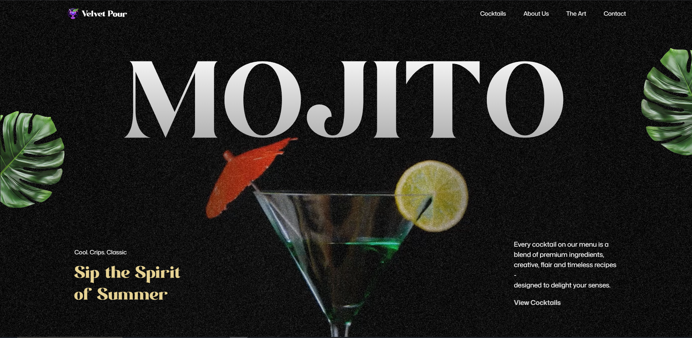

# 🍹 MojitoApp

Una elegante aplicación web de cocktails que celebra el arte de la mixología con animaciones fluidas y un diseño moderno.

## 📖 Sobre el Proyecto

**MojitoApp** es una página web interactiva dedicada a la presentación de cocktails premium. La aplicación combina diseño visual atractivo con animaciones suaves para crear una experiencia inmersiva que destaca la calidad y el arte de la preparación de bebidas.

### ✨ Características Principales

- **Hero Section Animado**: Video de fondo sincronizado con scroll y efectos de texto dinámicos
- **Galería de Cocktails**: Presentación elegante de diferentes tipos de mojitos y bebidas
- **Sección "The Art"**: Muestra el proceso artístico detrás de cada cocktail
- **Menú Interactivo**: Navegación fluida entre diferentes recetas con detalles
- **Sección "About Us"**: Información sobre la filosofía y calidad del servicio
- **Contacto**: Información de ubicación y redes sociales

### 🍸 Cocktails Destacados

- **Classic Mojito**: El clásico que nunca falla
- **Raspberry Mojito**: Una variación con frambuesa
- **Violet Breeze**: Una mezcla única y refrescante
- **Curacao Mojito**: Preparado con curaçao para un toque especial

